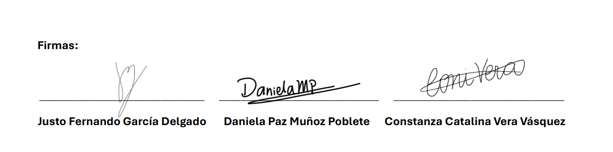

# Código de conducta de nuestro equipo

## 1. Propósito

Este documento define cómo cada equipo va a colaborar, comunicarse, resolver problemas y apoyarse durante el desarrollo del proyecto del curso **IIC2513 Tecnologías y Aplicaciones Web**. Su objetivo es que cada equipo converse y piense en situaciones que podrían llegar a ocurrir durante el semestre y que puedan abordarlas desde el respeto, la responsabilidad y la comprensión.

> [!TIP]
> Este documento no es un conjunto de reglas, sino una guía sobre qué hacer en cada situación. Este documento es una invitación para que conversen y sepan qué es lo que esperan de ustedes mismos y de su grupo. Confiamos en ustedes y su capacidad de autoregularse, pero también les pedimos que confíen en nosotros como equipo docente para apoyarles en todo lo que necesiten (para eso tienen un ayudante de grupo, ayudante de bienestar, ayudante coordinador y a su profesor).

## 2. Alcance

Aplica a todas las actividades relacionadas con el desarrollo del proyecto del curso, tales como:
- Reuniones de planificación, diseño e implementación
- Desarrollo y revisión de código
- Escritura de documentación e implementación de las entregas
- Interacción con el equipo docente, otros grupos del curso y entre estudiantes del equipo

## 3. Normas de Comunicación

> [!NOTE]
> Esto debe ser completado por cada equipo

### Canal de comunicación principal
> Nuestro equipo utilizará WhatsApp para la coordinación rápida y Discord para reuniones y seguimiento del proyecto.

### Reuniones de equipo 
> La frecuencia de las reuniones será de una vez a la semana durante el desarrollo de cada entrega. En caso de requerirse coordinación adicional, se podrán agendar reuniones extraordinarias según la necesidad del equipo o la complejidad de la etapa.
> Las reuniones se realizarán principalmente a través de Discord (para el equipo), utilizando canales de voz o videollamadas del servidor del equipo. Si fuera necesario, se podría utilizar otro medio como Google Meet o Teams acordando esto previamente.
> En el caso de las reuniones con el ayudante, el equipo se adaptará a la plataforma que este considere más conveniente, priorizando la coordinación y disponibilidad de ambas partes.

### Cuándo trabajar en el proyecto
> El equipo acordó trabajar principalmente durante la semana, organizando los avances desde el comienzo de cada entrega para mantener un progreso constante y evitar acumulaciones de trabajo hacia el final del plazo.
> En caso de ser necesario, se podrán realizar sesiones adicionales durante los fines de semana, especialmente para coordinar ajustes o revisiones. Sin embargo, se procurará evitar concentrar el trabajo en los días finales de entrega, priorizando una planificación anticipada que permita revisar con calma los resultados antes de la fecha límite.

### Organización de tareas y avances entre entregas (Adicional)
> El equipo acordó revisar en conjunto cada enunciado al inicio de la entrega, con el objetivo de entender completamente los requerimientos y definir la distribución de tareas de manera equilibrada según las habilidades y disponibilidad de cada integrante.
> Esta dinámica busca mantener una comunicación constante y una colaboración flexible durante todo el desarrollo del proyecto.

## 4. ¿Qué Haremos Cuando...?

> [!IMPORTANT]
> Para cada una de estas situaciones, deberán definir un paso a paso de las cosas que deberían hacer si la situación particular se presenta. Piénsenlo como una *checklist*, esto es un plan a seguir en caso de emergencia. Es importante que coloquen explícitamente quién realiza la acción (vean el ejemplo). Recuerden situaciones y experiencias similares y qué les hubiera gustado que ocurriera. La primera situación queda de ejemplo, pero pueden modificarla.

### 4.1 Enfermedad o emergencia de salud
> En caso de que uno de los miembros se enferme o no pueda trabajar en el proyecto del curso por razones de salud.

1. Si **YO** me enfermo, avisaré a mi equipo lo antes posible  
2. **Yo** indicaré el tiempo estimado de ausencia  
3. **Mi equipo** va a redistribuirse mis tareas temporalmente
4. **Como equipo** avisaremos al ayudante del grupo para su consideración
5. Si existe certificado médico, **YO** informaré al ayudante de bienestar y gestionar ante la DiPre

### 4.2 Carga académica excesiva / Tope de evaluaciones
> Muchas veces, en semestres anteriores, hemos visto que coinciden entregas del proyecto de este curso con tareas o interrogaciones de otros cursos. Es muy probable que en su grupo ocurra esto. Pónganse en esa situación y piensen qué les gustaría que ocurriera si ustedes u otra persona tiene este tipo de topes.

1. Si **YO** tengo una entrega o evaluación importante que coincide con el proyecto, avisaré al equipo con anticipación.
2. **Mi equipo** evaluará la redistribución temporal de mis tareas para mantener el avance general.
3. En la medida de lo posible, **YO** procuraré adelantar parte de mis responsabilidades antes del tope académico.
4. Si se requiere apoyo adicional, **los demás integrantes** colaborarán durante esa semana, priorizando las tareas más urgentes.
5. En compensación, **quien reciba apoyo** deberá participar con mayor dedicación en la siguiente entrega, para equilibrar el esfuerzo grupal.

### 4.3 Indisponibilidad prevista (viajes, vacaciones)
> En ocasiones, algún estudiante podría tener un viaje o evento previsto que le impida trabajar en el proyecto en algún momento del semestre. Conversen sobre eso: ¿tengo algo planificado que pueda impedir que trabaje algún o algunos días? En otras ocasiones hemos visto: viajes para asistir a matrimonios o competencias deportivas, participación en eventos de larga duración, o incluso por razones religiosas. Si no tienen esta indisponibilidad, pueden colocar eso: "Ninguno de los miembros de este equipo reportó tener alguna indisponibilidad prevista"

1. Si **YO** tengo una indisponibilidad prevista, avisaré al equipo con la mayor anticipación posible.
2. **Mi equipo** coordinará el ritmo de trabajo considerando ese período, evaluando si puedo **adelantar parte de mis tareas** o realizarlas **prontamente al regresar**.
3. **Durante mi ausencia**, el resto del grupo podrá **ajustar temporalmente la distribución de responsabilidades** para mantener el avance del proyecto.
4. En caso de que mi participación sea limitada durante ese tiempo, **me comprometeré a aportar con mayor dedicación en la siguiente entrega**, equilibrando así el esfuerzo grupal.
5. Si la indisponibilidad coincide con una etapa crítica del proyecto, **como equipo** se informará al ayudante del grupo para dejar constancia.

### 4.4 Emergencia personal no planificada
> Es difícil resumir todas las situaciones que podrían ocurrir a nivel personal y que impiden que podamos continuar con nuestras responsabilidades académicas: hay cosas más importantes que una evaluación en la universidad. Traten de pensar en situaciones generales: ¿qué me gustaría que ocurriera si realmente no puedo contribuir a mi equipo por alguna razón fuera de mi alcance? (Podría servirles colocar ejemplo)

1. Si **YO** enfrento una emergencia personal, avisaré al equipo lo antes posible, entregando una estimación general del tiempo en que no podré participar.
2. **Mi equipo** mostrará comprensión y apoyo, **redistribuyendo temporalmente las tareas** para mantener el avance del proyecto.
3. Si es posible, **YO** intentaré retomar mis responsabilidades una vez que la situación esté bajo control.
4. Si la emergencia impacta el cumplimiento de una entrega o la comunicación general, como equipo se informará al ayudante del grupo para dejar constancia y recibir orientación.

### 4.5 Retraso en entrega / Inclumplimiento de plazo
> Sabemos que tienen la capacidad de desarrollar el proyecto de buena manera y obtener la mayor nota posible (sería injusto darles un proyecto que no esperamos que puedan completar), pero si por algún motivo no pudieran entregar todo a tiempo, ¿qué planean hacer?

1. Si **como equipo** no tenemos el entregable listo para el día de la entrega.
2. **Como equipo**, evaluaremos el avance general y **priorizaremos entregar lo que esté correctamente realizado**, asegurando que el trabajo enviado mantenga un nivel adecuado de calidad.
3. Luego de la entrega, **realizaremos una reunión interna** para analizar las causas del retraso y **reestructurar el ritmo de trabajo** con el fin de mejorar la organización en las siguientes etapas.
4. **Revisaremos la distribución de tareas y los tiempos asignados**, buscando optimizar la coordinación y evitar que la situación se repita.
5. En caso de que el retraso sea significativo o pueda afectar la evaluación, **informaremos al ayudante del grupo**, explicando las medidas que se adoptarán para corregir el problema.

### 4.6 Persona no ubicable o contactable (no responde)
> Esta situación tiende a ocurrir cuando un miembro está colapsado o enfrentando múltiples situaciones y/o evaluaciones. Pueden ser muchas cosas. Lo importante aquí es que se pongan en la situación de qué harían como grupo si es que no pueden contactar a uno de los miembros para seguir progresando y la persona no aparece en un tiempo razonable. Recuerden que pueden informar al equipo docente para evaluar su situación, esto con el objetivo de dejar respaldo cuando respondan la evaluación de pares de cada entrega (sí, hay evaluación de pares que afecta la nota individual)

1. Si **como equipo** no conseguimos respuesta de un miembro para asignar responsabilidades o confirmar que está progresando.
2. **Como equipo**, intentaremos contactar a la persona lo antes posible a través de los distintos medios de comunicación del grupo (WhatsApp, Discord u otros).
3. Si no se obtiene respuesta en un plazo razonable, **uno de los integrantes** enviará un mensaje directo y esperará confirmación de lectura o respuesta.
4. En caso de no lograr comunicación tras varios intentos, **el equipo informará la situación al ayudante del proyecto**, solicitando orientación sobre cómo proceder.
5. Si el caso lo amerita, se contactará además al **ayudante de bienestar**, con el fin de buscar una solución adecuada y acompañamiento si fuese necesario.
6. Mientras tanto, el resto del equipo reorganizará las tareas de forma temporal para mantener el avance del proyecto.

### 4.7 Diferencias de opinión
> Trabajar en grupo es difícil y es una habilidad que se sigue desarrollando más allá de la universidad incluso. Incluso si se conocieran y fueran muy amigos, es posible que tengan diferencias de opinión durante el desarrollo del proyecto. Imaginen que tienen visiones o ideas muy distintas, ¿cuál sería un buen proceso para llegar a un consenso?

1. Si **como equipo** no logramos llegar a un acuerdo sobre una decisión del proyecto.
2. **Como equipo**, iniciaremos un diálogo constructivo en un ambiente de respeto, donde cada integrante pueda exponer y fundamentar su punto de vista.
3. Analizaremos los distintos enfoques considerando sus implicancias técnicas, de tiempo y de impacto en el proyecto.
4. Mantendremos una actitud flexible y colaborativa, recordando que el objetivo común es el éxito del proyecto y no las preferencias individuales.
5. En caso de no llegar a consenso, se tomará una decisión grupal por mayoría, priorizando la opción que aporte mayor beneficio al resultado final.
6. Si la diferencia persiste o afecta el funcionamiento del equipo, se solicitará apoyo al **ayudante del grupo** para mediar o entregar orientación.

### 4.8 Riesgo de no completar el proyecto
> La última entrega del proyecto del curso es reprobatoria. Planifíquense con esto en mente. Sin embargo, a veces existen situaciones que nos impiden cumplir con nuestras planificaciones (algunas ya mencionadas, otras no planificadas, a veces el proyecto es muy ambicioso, etc.). Si en algún punto creen que no alcanzan a completar la última entrega del proyecto dentro del plazo establecido, ¿qué piensan hacer?

1. Si **como equipo** creemos que podríamos no llegar con el proyecto listo a la última entrega, lo comunicaremos de inmediato entre los integrantes.
2. **Como equipo**, actuaremos con transparencia inmediata, comunicando la situación a todos los integrantes y evaluando objetivamente el estado de avance.
3. Nuestra prioridad será redefinir el alcance del trabajo junto al **ayudante del grupo**, enfocándonos en **entregar un Producto Mínimo Viable (MVP)** que refleje el valor esencial del proyecto.
4. Reorganizaremos las tareas internas para concentrar los esfuerzos en los elementos críticos del desarrollo y cumplir con los objetivos mínimos definidos.

### 4.9 Manteniendo la integridad académica
> Ya en la primera clase del curso hablamos de integridad académica (incluyendo cómo citar y cómo referenciar el uso de IA). ¿Cómo piensan mantener la integridad académica? Conversen sobre cómo piensan citar y referenciar el uso de código de fuentes externas, sobre cómo piensan utilizar IA durante el semestre y... respondan en su checklist lo más difícil: ¿qué harían si identifican código externo o de una IA que no ha sido referenciado por otro miembro de su equipo?

1. **Como equipo**, utilizaremos IA y código externo de manera transparente y responsable, citando siempre su origen y propósito en la documentación correspondiente.
2. Si **YO** incorporo código generado por una IA o proveniente de una fuente externa, me aseguraré de dejar constancia clara de su procedencia, conforme a las directrices del curso.
3. Si identificamos código que parece provenir de una IA o fuente externa no citada, suspenderemos su uso de inmediato para investigar su origen.
4. En caso de no poder referenciar adecuadamente el contenido, el código será eliminado o reescrito por el equipo, garantizando la integridad académica del proyecto.
5. Si la situación requiere orientación adicional, informaremos al ayudante del grupo para asegurar una resolución adecuada y transparente.

## 4. Firma de cada integrante del grupo
