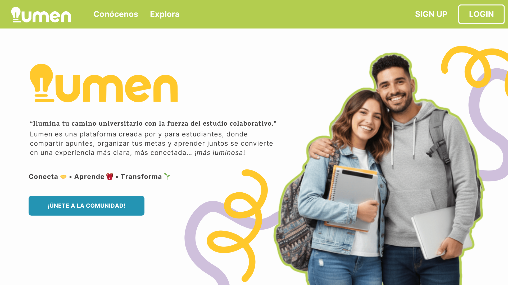
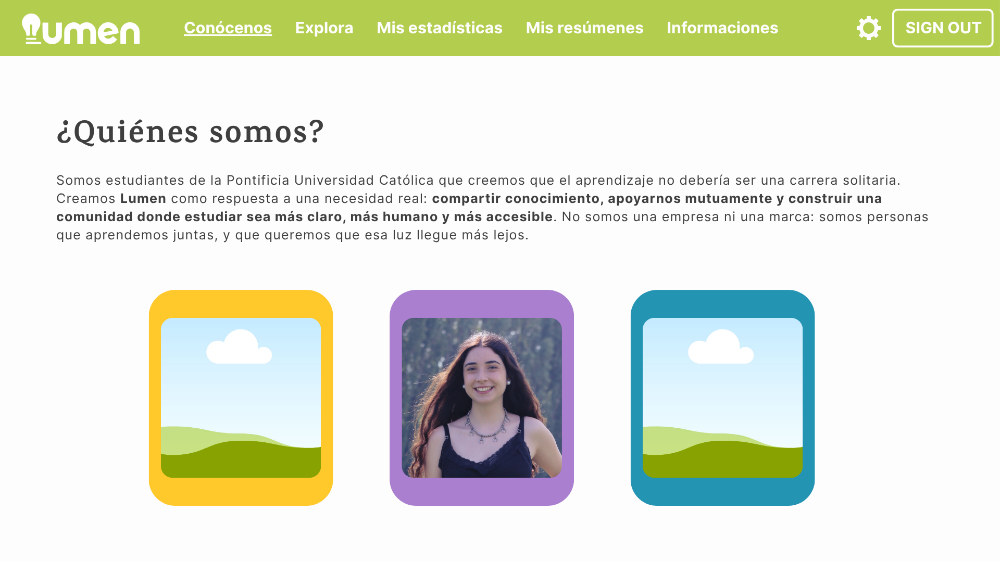
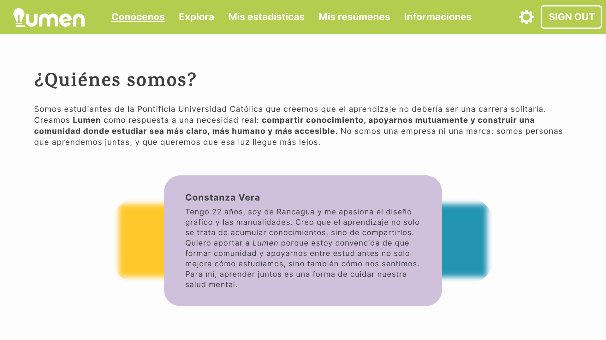

# E0 💫 - FRONTEND
* Grupo CDJ: Constanza Vera, Daniela Muñoz y Justo García.

## Descripción general 💭

**¿De qué se tratará el proyecto?**

Lumen es una <u>red social</u> académica creada por y para estudiantes universitarios, que busca transformar el estudio en una experiencia colaborativa. A través de herramientas para compartir apuntes, organizar metas y visualizar el progreso académico, el proyecto promueve una forma de aprender más conectada, accesible y emocionalmente saludable.

**¿Cuál es el fin o la utilidad del proyecto?**

El propósito de Lumen es facilitar el aprendizaje entre pares, fomentando la creación de comunidades estudiantiles que se apoyen mutuamente. Su utilidad radica en ofrecer un espacio donde los estudiantes puedan intercambiar conocimientos, acompañarse en sus procesos académicos y reducir el aislamiento que muchas veces se vive en la universidad. Además, busca mejorar el bienestar emocional mediante el estudio compartido.

**¿Quiénes son los usuarios objetivo de su aplicación?**

Los usuarios principales son estudiantes universitarios, inicialmente solo de la Universidad Católica. Especialmente para aquellos que valoran el aprendizaje colaborativo y que enfrentan desafíos como la sobrecarga académica, la falta de recursos o el estrés emocional. Lumen está pensado para quienes quieren estudiar con otros, compartir materiales, organizar sus metas y sentirse parte de una comunidad.

## Historia de Usuarios 👥 (PENDIENTE)

1. Como [rol/usuario] quiero [requerimiento] para [objetivo]
2. ...
3. ...

## Diagrama Entidad-Relación 📜 (PENDIENTE)

## Diseño Web 💻

### 🎨 Documento de diseño

### 🔍 Vistas principales

### 👀 Logo

### 📱 Ejemplo de aplicación
#### Landing Page:

#### About us:

*En esta sección la vista de la infomación de cada integrante se hará mediante un hover interactivo, extraído de [uiverse.io](https://uiverse.io/kamehame-ha/chilly-snake-91).

## Referencias ⚠️
* Uso de inteligencia artificial (ChatGPT - Copilot) para formular textos más profesionales, para hacer el logo y para generar la imagen de las personas abrazadas en el _landing page_.
* [uiverse.io](https://uiverse.io/) para ideas de estilo y css.